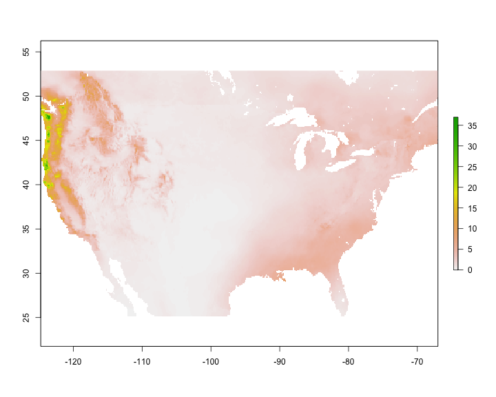

<!--
%\VignetteEngine{knitr::knitr}
%\VignetteIndexEntry{cmipr introduction}
%\VignetteEncoding{UTF-8}
-->


cmipr introduction
==================

`cmipr` - Client to work with CMIP data - downscaled climate and hydrology 
projections. Package lists avail. files, downloads and caches, and reads 
into raster objects. 

## Install

Dev version


```r
devtools::install_github("ropenscilabs/cmipr")
```


```r
library("cmipr")
```


## List files

List files in their FTP directory


```r
cmip_list_files()
#> # A tibble: 9 × 2
#>         date           file
#>       <date>          <chr>
#> 1 2014-04-02 bcsd/1950-2099
#> 2 2014-04-02      bcsd/2deg
#> 3 2015-06-02               
#> 4 2014-04-02               
#> 5 2011-08-23               
#> 6 0016-08-26               
#> 7 2014-06-20               
#> 8 2014-06-17               
#> 9 2014-04-02    bcsd/yearly
```


```r
cmip_list_files('cmip5/bcsd')
#> # A tibble: 4 × 2
#>         date    file
#>       <date>   <chr>
#> 1 2014-03-28      BC
#> 2 2014-03-28    BCSD
#> 3 2014-03-28 SD_noBC
#> 4 2014-03-28  regrid
```

## Fetch data

Define a path to a file.


```r
key <- "bcsd/yearly/cnrm_cm3.1/cnrm_cm3.1.sresa1b.monthly.Prcp.2034.nc"
```

Fetch the file


```r
(res <- cmip_fetch(key))
#> <CMIP file>
#>    File: /Users/sacmac/Library/Caches/cmipr/cnrm_cm3.1.sresa1b.monthly.Prcp.2034.nc
#>    File size: 4.93842 MB
```

### Caching

When requesting data, we first check if you already have that data cached.
You'll know when this happens as the request will finish much faster when
you have data cached already.

We use the package `hoardr` to manage cached files.

On package load, a hoardr object is created, it's an R6 object.


```r
cmip_cache
#> <hoard> 
#>   path: cmipr
#>   cache path: /Users/sacmac/Library/Caches/cmipr
```

See `?cmip_cache` for all cache management help.

The `cmip_cache` object has variables and functions on it. For example, 
we can get the cache path


```r
cmip_cache$cache_path_get()
#> [1] "/Users/sacmac/Library/Caches/cmipr"
```

Or list all files in the cache


```r
cmip_cache$list()
#> [1] "/Users/sacmac/Library/Caches/cmipr/cnrm_cm3.1.sresa1b.monthly.Prcp.2034.nc"
```

Or delete all files (won't run this here though)


```r
cmip_cache$delete_all()
```


## Read data

After fetching data, you need to read the data into a `RasterLayer` or
`RasterBrick` object

Get some data first


```r
keys <- c(
  "bcsd/yearly/cnrm_cm3.1/cnrm_cm3.1.sresa1b.monthly.Prcp.2039.nc",
  "bcsd/yearly/gfdl_cm2_1.1/gfdl_cm2_1.1.sresa1b.monthly.Prcp.2033.nc"
)
res <- lapply(keys, cmip_fetch)
```

You can read a single file


```r
cmip_read(res[[1]])
#> class       : RasterLayer 
#> band        : 1  (of  12  bands)
#> dimensions  : 222, 462, 102564  (nrow, ncol, ncell)
#> resolution  : 0.125, 0.125  (x, y)
#> extent      : -124.75, -67, 25.125, 52.875  (xmin, xmax, ymin, ymax)
#> coord. ref. : +proj=longlat +datum=WGS84 +ellps=WGS84 +towgs84=0,0,0 
#> data source : /Users/sacmac/Library/Caches/cmipr/cnrm_cm3.1.sresa1b.monthly.Prcp.2039.nc 
#> names       : Prcp 
#> z-value     : 2039-01-16 
#> zvar        : Prcp
```

many files


```r
cmip_read(unlist(res))
#> class       : RasterBrick 
#> dimensions  : 222, 462, 102564, 24  (nrow, ncol, ncell, nlayers)
#> resolution  : 0.125, 0.125  (x, y)
#> extent      : -124.75, -67, 25.125, 52.875  (xmin, xmax, ymin, ymax)
#> coord. ref. : +proj=longlat +datum=WGS84 +ellps=WGS84 +towgs84=0,0,0 
#> data source : in memory
#> names       :       Prcp.1,       Prcp.2,       Prcp.3,       Prcp.4,       Prcp.5,       Prcp.6,       Prcp.7,       Prcp.8,       Prcp.9,      Prcp.10,      Prcp.11,      Prcp.12,      Prcp.13,      Prcp.14,      Prcp.15, ... 
#> min values  : 0.0000000000, 0.0014285714, 0.0000000000, 0.0000000000, 0.0000000000, 0.0000000000, 0.0000000000, 0.0010645161, 0.0000000000, 0.0000000000, 0.0000000000, 0.0018709678, 0.0648709685, 0.0221071430, 0.0000000000, ... 
#> max values  :    36.971066,    16.024536,    30.073355,    18.687033,    19.824322,    11.378433,     8.971000,    13.397967,    12.315033,    53.819515,    43.141335,    38.081871,    29.059355,    24.486929,    24.351355, ...
```

## Visualize


```r
library("raster")
plot(cmip_read(res[[1]]))
```


